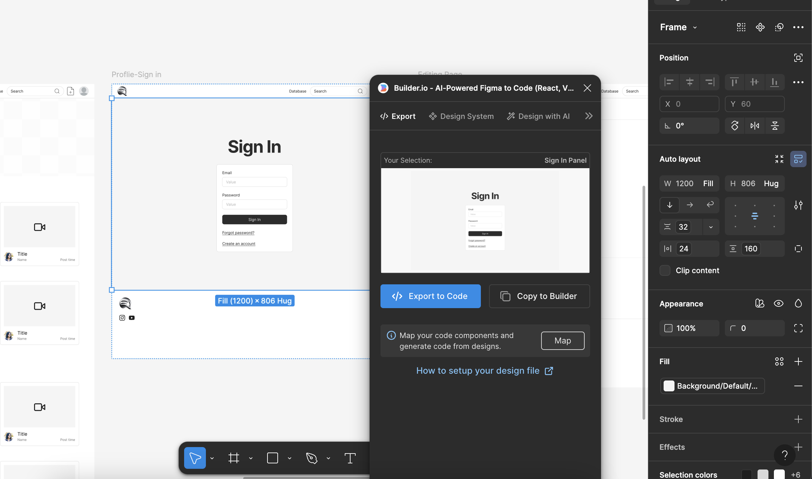
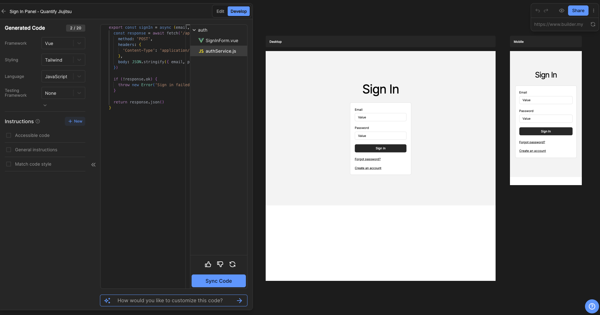
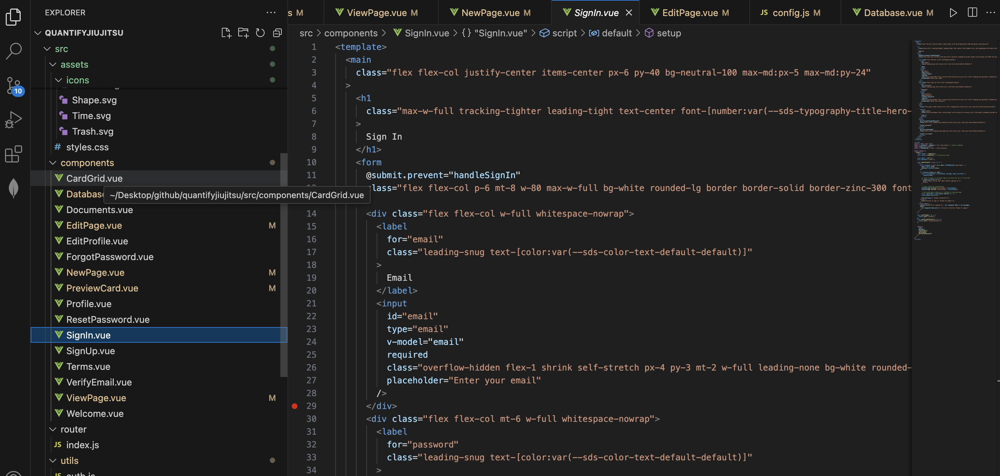

## Prerequisite 
Before starting, ensure the following steps are completed:
1. **UI Design Completed in Figma:**
   - Your application’s user interface should already be fully designed in Figma.
2. **Vue.js Development Environment Setup:**
   - Install Node.js and npm (or yarn).
   - Create a Vue.js project using Vue CLI or Vite:
     ```bash
     # Using Vue CLI
     vue create my-project

     # Using Vite
     npm create vite@latest my-project --template vue
     ```
   - Start the development server:
     ```bash
     cd my-project
     npm run dev
     ```

## What is Builder.io
**Builder.io is by far the most accurate and reliable way I found for generating code from Figma designs.** Builder.io is a powerful visual development tool that enables designers and developers to create and convert designs into production-ready code for various frameworks, including Vue.js. It integrates seamlessly with Figma, allowing users to export components or full pages directly into clean, reusable code. This tool is especially helpful for bridging the gap between design and development, reducing manual coding efforts while maintaining design fidelity.

Key features of Builder.io include:
- Support for multiple frameworks (Vue.js, React, Angular, etc.).
- Tailwind CSS integration for consistent styling.
- Modular component generation for scalability.
- Easy-to-use Figma plugin for direct export.

## Turning Figma Visual designs into Code
Follow these steps to convert your Figma design into Vue.js code:

### Install and Use the Builder.io Plugin
1. **Search for Builder.io in Figma:**
   - Open Figma and navigate to the "Plugins" section.
   - Search for the **Builder.io** plugin and install it.
   - Open your design in Figma and run the Builder.io plugin.

2. **Export Components:**
   - Select components or elements in your design that you want to convert into code.
   - I recommend exporting reusable components (e.g., buttons, forms, headers) individually for better modularity.
   - Use Builder.io to generate Vue.js code for each component.


### Address Common Issues
1. **Inspect Generated Code:**
   - Open the generated Vue.js code and verify its structure, styles, and logic.
   - Pay special attention to CSS classes, bindings, and event handling.
   - 

2. **Fix Known Issues:**
   - My personal experience suggests that the button background color might not always match the design.
   - Check the `class` or `style` properties for buttons and update them with the correct Tailwind CSS class or inline style:
     ```html
     <button class="bg-blue-500 text-white py-2 px-4 rounded">
       Button Text
     </button>
     ```
    - 
